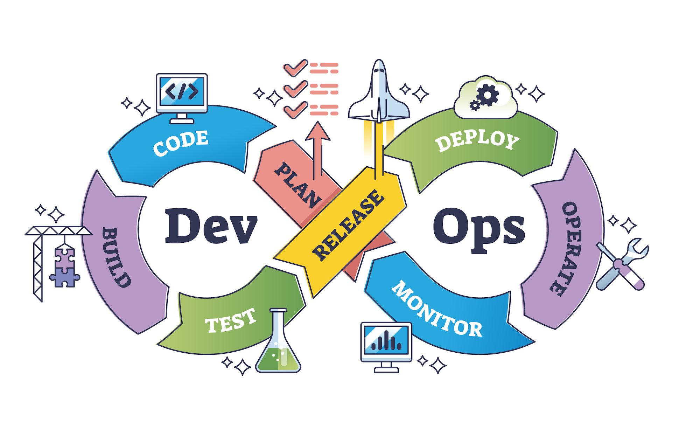

XR System development can use well-known methodologies for software engineering.

{alt="agile"}

Development brings together teams with complementary expertise using:

- Agile iterative philosophy for software development
focusing on collaboration and user-centered development, and 
- DevOps methodology to deploy code using modern tools
and automated processes.

See more information on [Agile vs DevOps](https://www.atlassian.com/devops/what-is-devops/agile-vs-devops).

{alt="devops"}

## Prototyping

A prototype is a low-fidelity version of the envisaged product. Prototyping focuses on exploring a MVP and how useful is the product is to the user.

Helps to illustrate an idea or better define the 'problem' (exploratory).

It can bring together stakeholders from the initial stages of development.

More information:
- [CHI 2021 XR Prototyping Course](https://xr-prototyping.org/)

- Veronika Krauß, Michael Nebeling, Florian Jasche, and Alexander Boden. 2022. Elements of XR Prototyping: Characterizing the Role and Use of Prototypes in Augmented and Virtual Reality Design. In Proceedings of the 2022 CHI Conference on Human Factors in Computing Systems (CHI '22). Association for Computing Machinery, New York, NY, USA, Article 310, 1–18. [https://doi.org/10.1145/3491102.3517714](https://doi.org/10.1145/3491102.3517714)

## Additional considerations
- Non functional requirements: Accessibility, inclusivity (or exclusivity)
- Larger picture: Business models, inc. funding and points of sale/purchase

::::::::::::::::::::::::::::::::::::: keypoints 

- Software development methodologies apply to XR design
- Prototyping is a key step in the process

::::::::::::::::::::::::::::::::::::::::::::::::

