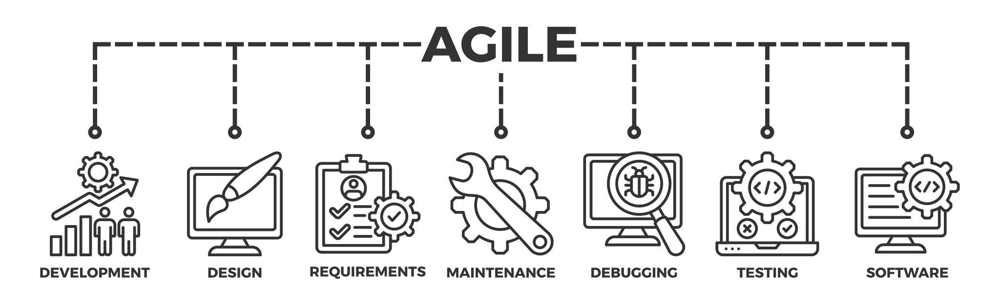

## Verification and validation
These are processes within the software development cycle which 
determine whether the VR software:

1. Conform to the requirements, e.g. set by [specific distribution platforms](https://karina-rodriguez.github.io/2024-XR-interoperability/distribution-of-vr.html).
2. Satisfies its intended use and user needs.

### Quality Stamp

{alt="agile" width="400px"}

Satisfying verification and validation tasks are part of the testing processes, which is part of the agile development. Undertaking these processes in an organised
and traceable way can also lead to a *quality stamp* for the software
development team. For example, there are international quality standards for software testing. 

Organisations can apply to certify that they undertake these processes and produce 'quality' software.
[ISO/IEC 29119](https://www.iso.org/standard/81291.html) is a standard for software testing.

## Types of testing

Many types of testing, some functional such as:

1. Unit testing
2. Integration testing
3. System testing

and non-functional:

4. Performance testing
5. Security testing
6. Usability testing
7. Compatibility testing

We also distinguish betweem **black box** testing techniques, and
**white box** testing techniques, which distinguishes
how much access/how close the user has to the code.

{alt="agile" width="400px"}

### Heuristics
**Black box** testing is done by testers who don't know anything about how the software has been put together. 

The goal is for them to interact with your software as a user might.
Black box testing typically analyzes input/output, observable behavior, and heuristics.

{alt="video"}

## User Experience (UX) Evaluation

User Experience (UX) Evaluation is a critical task, given that gathering and making sense of audience feedback enables to reflect on the success of the experience that was designed. It considers elements such as:

- Utility: Is the user finding the system's functions practical and appropriate for their needs? Usability: Does the user find it straightforward and efficient to accomplish tasks with the system?
- Aesthetics: Does the user find the system visually appealing? Is it pleasant to interact with?
- Identification: Can the user relate to the product? Does the users feel good about themselves when using it?
- Stimulation: Does the system spark creativity or provide exciting experiences?
- Value: Is the system significant to the user? What value does it hold in their perspective?

Usability in UX refers to the ease with which users can interact with a product or system to achieve their goals effectively, efficiently, and with satisfaction. Usability assesses how user-friendly and intuitive a product is, focusing on factors such as ease of learning, efficiency of use, memorability, error prevention and recovery, and user satisfaction.

There are different ways to conduct usability testing, yet typically this includes a number of tasks which the users have to accomplish while facilitators observe, listen and make notes.

In addition, useful data to take into account when evaluating a digital application or system are log data, automatically generated to track transactions, changes, and performance metrics. Log data include page views, click-through rates, bounce rate, session duration, error rate, scroll depth and more.

More information on usability testing and the way/s to conduct it can be found here:

-	Moran, K. (2019). Usability Testing 101. Nielsen Norman Group logoNielsen Norman Group. Retrieved from: [https://www.nngroup.com/articles/usability-testing-101/](https://www.nngroup.com/articles/usability-testing-101/) 
