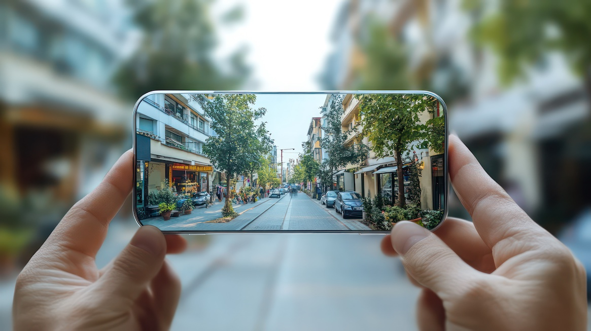

:::::::::::::::::::::::::::::::::::::: questions 

- How can design good XR experiences?
- How important is good design of XR systems?
- How can XR systems be designed to respond to sustainability concerns?

::::::::::::::::::::::::::::::::::::::::::::::::

::::::::::::::::::::::::::::::::::::: objectives

- Reflect on good design practices for XR systems.
- Learn basic elements of XR-system development including software development cycle,  
design consideration.
- Understand the processes to elucidate and design an XR-system 
 focused on a user. 

::::::::::::::::::::::::::::::::::::::::::::::::

## What is the meaning of design in interactive XR experiences?

::::::::::::::::::::: challenge

## Challenge: How do we design systems?

In groups of 2, reflect on the software systems you have
worked on in the last couple of years, and discuss:

1. What the final product was?
2. Who were the intended users of this product?
3. How did you take into account their needs, if you did so?
4. What does good design means to you?

::::::::::::::::

## Interactive Experiences

In **User Design (UX)**, interactive experiences connect 
users with an 'environment' in non-passive ways.

An **experience developer** designs an interactive system, 
but the way the experience is perceived belongs to the user.
The experience touches on the persons' senses, experiences, 
and their surroundings, including other people.

{alt="system user"}

## What is the meaning of design?

In software systems, design often refers to the systems' interaction, 
User Interface (UI) and User Experience (UX). 
This includes user interface and user experiences design, 
devices or services that promote or enable better interaction. 

Good design is almost always based on basic principles, such as:

- *Quality of function*: does the system fullfil a need or function?
- *Aesthetics*: is the system's interface pleasant to look at?
- *Usability*: is the system self-explanatory and easy to use?
- *Responsibility*: which are the sustainability effects, including environmental, societal, economic, individual, and technical, that the use of the system has? does it promote postive effects?

From the [Red Dot Design Awards](https://www.red-dot.org/fileadmin/downloads/Guide_to_success/BCD_2020/15_2020_Interface___User_Experience_Design_englisch.pdf), examples of systems which display these qualities:

#### Be Fearless app

{alt="video" }

::::::::::::::::::::: challenge

## Challenge: Examples of good design

In groups of 2, think of software systems, 
either mobile apps, VR applications
or PC software systems which display 
qualities of good design. 

Reflect on how does the system addresses the four principles covered?

::::::::::::::::

Additional Links: 

- https://www.red-dot.org/magazine/communication-design-at-the-highest-level-awarded-interface-user-experience-design
