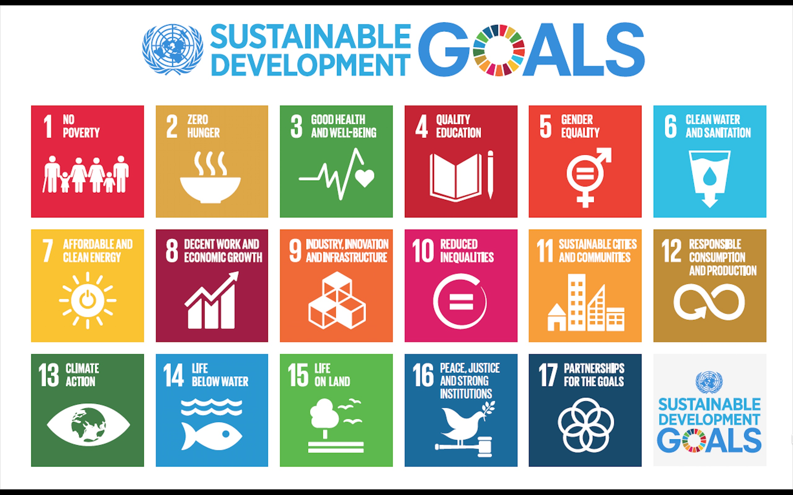

{alt="system user" width="400px"}

> Sustainability is fundamental to our society. The current state of our world is unsustainable in more ways that we often recognize. Technology is part of the dilemma and part of possible responses. (Karlskrona Manifesto for Sustainability Design, 2024)

VR and XR technologies offer opportunities to support sustainability goals.

{alt="video" }

When thinking on the impacts of the systems we design, there is
various orders to consider [^1]:

- **First-order order** (also termed direct, immediate): effects are direct effects of the production, operation, use, and disposal of IT solutions.
- **Second-order**  (also termed indirect, enabling): effects are linked with the operation and use of an IT-based system and include any change enabled or induced by it.
- **Third order** (also termed structural, systemic): effects consist of structural changes caused by 
the ongoing operation and use of the solution.

When designing XR systems, it is important to consider early on 
how to mitigate potential negative effects that introducing certain features will cause, 
or how to support positive impacts of the system.

## The Karlskrona Manifesto for Sustainability Design

::::::: challenge
### Challenge: Read the Manifesto

Explore the Karlskrona Manifesto, including the proposed
principles and commitments.

Discuss how sustainability impacts the design and development of VR systems.

URL: https://sustainabilitydesign.org/karlskrona-manifesto/

:::::::

## Examples of XR systems for sustainability

The project [Wood to Outcomes](https://community21.org/casestudies/44886_woods_to_outcomes) explores the use of Sussex local material, 
in particular wood, 
for local products in social housing.

Digital experiences are explored as a means to 
monitor remotely the woods, and 
engage and 
educate the user community 
on the importance of material 
provenance, and elevate the values associated with
local resource models and products.

Other potential sources of content:

- https://www.wildlifetrusts.org/webcams
- https://www.brightoncctv.co.uk/i360-cams

[^1]: Stefanie Betz, Birgit Penzenstadler, Leticia Duboc, Ruzanna Chitchyan, Sedef Akinli Kocak, Ian Brooks, Shola Oyedeji, Jari Porras, Norbert Seyff, and Colin C. Venters. 2024. Lessons Learned from Developing a Sustainability Awareness Framework for Software Engineering Using Design Science. ACM Trans. Softw. Eng. Methodol. 33, 5, Article 136 (June 2024), 39 pages. https://doi.org/10.1145/3649597

